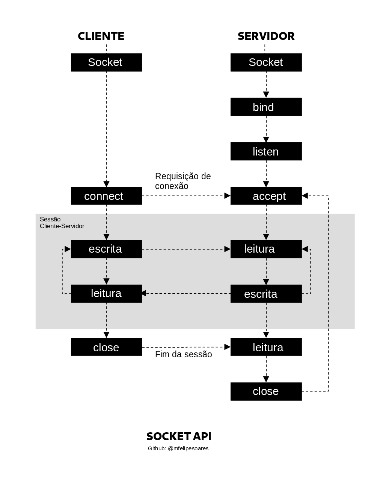

<h1> Socket em C 🎯 </h1>

Um socket de rede é uma interface de programação que permite que processos de software em diferentes computadores se comuniquem uns com os outros através de uma rede. É uma combinação de um endereço IP e um número de porta que identifica exclusivamente um processo de software. Os sockets são usados em uma variedade de aplicativos de rede, permitindo que dispositivos se comuniquem eficientemente em uma rede de computadores.

<h2> 📝 Modelo Utilizado </h2>

<h2>📜 Linguagem Utilizada</h2>
